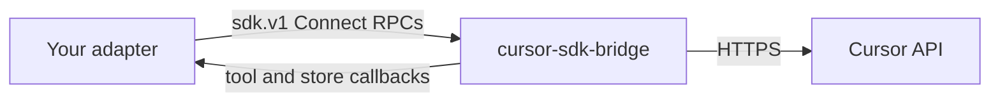

# Cursor SDK Bridge

The SDK Bridge is a small local server that embeds the TypeScript SDK and exposes the same agent surface over a stable Connect/protobuf protocol. Use it to script Cursor agents from languages without a first-party SDK.

If you write TypeScript or Python, install the first-party [TypeScript](https://cursor.com/docs/sdk/typescript.md) or [Python](https://cursor.com/docs/sdk/python.md) SDK instead. Python already talks to a bundled copy of the bridge.

The protocol, standalone binaries, and adapter guide live in [`cursor/sdk-bridge`](https://github.com/cursor/sdk-bridge). Pin a release, then point a Cursor agent at that repo to build a thin adapter.

Cursor publishes and supports the `sdk.v1` contract and bridge binaries.
Adapters in other languages are not first-party SDKs. Lead with TypeScript or
Python unless you need a language those packages do not cover.

## When to use it

| Path                                                                     | Use when                                                           |
| :----------------------------------------------------------------------- | :----------------------------------------------------------------- |
| [TypeScript SDK](https://cursor.com/docs/sdk/typescript.md)              | You're writing TypeScript or JavaScript.                           |
| [Python SDK](https://cursor.com/docs/sdk/python.md)                      | You're writing Python.                                             |
| [SDK Bridge](https://github.com/cursor/sdk-bridge)                       | You need Go, Rust, Java, C#, or another language.                  |
| [Cloud Agents API](https://cursor.com/docs/cloud-agent/api/endpoints.md) | You only need cloud agents over HTTP, with no local agent runtime. |

The bridge is for SDK authors and platform teams. Application code should depend on `@cursor/sdk` or `cursor-sdk`.

## How it works



Your adapter spawns `cursor-sdk-bridge`, or attaches to one your platform already runs. The bridge binds a loopback HTTP/1.1 port and serves the `sdk.v1` services. Because it embeds `@cursor/sdk`, new agent features land once in the bridge. Adapters pick them up by bumping the binary.

Classic gRPC over HTTP/2 will not connect. Use a [Connect](https://connectrpc.com/docs/protocol) client, or plain `POST`s with protobuf or JSON bodies.

## Get started

### Get an API key

SDK runs accept user API keys and service account API keys. Team Admin API keys are not supported yet.

- [Cursor Dashboard → API Keys](https://cursor.com/dashboard/api)
- [Service accounts](https://cursor.com/docs/account/enterprise/service-accounts.md)

```bash
export CURSOR_API_KEY="your-key"
```

### Pin a bridge release

Each GitHub release tag matches the TypeScript and Python SDK version. Download the standalone archive for your platform from [GitHub releases](https://github.com/cursor/sdk-bridge/releases). Each archive unpacks to:

- `bin/cursor-sdk-bridge` (`.exe` on Windows)
- `proto/sdk/v1/` (the contract for that binary)
- `manifest.json`

Use `darwin`, `linux`, or `win32` with `x64` or `arm64`. Windows is `x64` only.

The same binary ships inside `cursor-sdk` wheels. After `pip install cursor-sdk`, `cursor-sdk-bridge` is on your `PATH`.

### Point an agent at the repo

Open Agent and run this prompt. It points Cursor at [`cursor/sdk-bridge`](https://github.com/cursor/sdk-bridge) and the adapter build guide.

Read https\://github.com/cursor/sdk-bridge and follow the Agent: start here guide in the README. Build a thin Cursor SDK adapter in this repository's primary language. Cover codegen from proto/sdk/v1, bridge process lifecycle, streaming, errors, and callback servers.

Confirm a fresh binary before you debug adapter code:

```bash
cursor-sdk-bridge --help
```

When an RPC fails and your adapter can't see why, run the bridge with `--verbose` (or set `CURSOR_SDK_BRIDGE_LOG=1`) to log each RPC's name, outcome, duration, and full error to stderr. Request and response payloads are never logged.

The repo also has a [curl-only smoke test](https://github.com/cursor/sdk-bridge/blob/main/docs/smoke-test.md) that exercises spawn, `Ping`, `Me`, `CreateAgent`, and `Send` with no adapter code.

## Adapter shape

An adapter is a library another developer can install without knowing the bridge exists. First-party SDKs converge on this shape:

| Piece                     | Role                                                                                                                    |
| :------------------------ | :---------------------------------------------------------------------------------------------------------------------- |
| **Bridge manager**        | Find or spawn the binary, complete the ready-line handshake, and shut it down. Allow attaching to an existing endpoint. |
| **Transport**             | Connect over HTTP/1.1: unary POSTs and streamed responses, with bearer auth on every call.                              |
| **Client**                | Low-level typed RPCs for agents, runs, models, and repositories.                                                        |
| **Agent and Run handles** | The public API: create, send, stream events, wait, and cancel.                                                          |
| **Errors**                | Map Connect codes and `sdk.v1` error details onto exceptions or result types in your language.                          |
| **Callback servers**      | Optional loopback servers so users can define custom tools and stores in your language.                                 |

Ship a one-prompt helper (create, send, wait, close) and a context-manager or RAII form so the bridge process cannot leak.

## Protocol

The wire contract is protobuf package `sdk.v1`:

| Proto                                    | Role                                                                       |
| :--------------------------------------- | :------------------------------------------------------------------------- |
| `sdk_agent_service.proto`                | Create and resume agents, send prompts, stream runs, artifacts, and usage. |
| `sdk_cursor_service.proto`               | Identity, models, and repositories.                                        |
| `sdk_bridge_control_service.proto`       | Ping, version, shutdown, and tool-callback registration.                   |
| `sdk_custom_tool_callback_service.proto` | Hosted by your adapter. The bridge calls it to run user-defined tools.     |
| `sdk_store_callback_service.proto`       | Hosted by your adapter for custom agent stores.                            |
| `sdk_messages.proto`                     | Shared messages and the run-stream envelope.                               |
| `sdk_errors.proto`                       | Structured error details.                                                  |

Leave `proto/` untouched when you vendor it. Cursor regenerates those files on every SDK release.

Details stay in the repo:

- [Lifecycle and handshake](https://github.com/cursor/sdk-bridge/blob/main/docs/protocol.md)
- [Services](https://github.com/cursor/sdk-bridge/blob/main/docs/services.md)
- [Streaming](https://github.com/cursor/sdk-bridge/blob/main/docs/streaming.md)
- [Errors](https://github.com/cursor/sdk-bridge/blob/main/docs/errors.md)
- [Curl smoke test](https://github.com/cursor/sdk-bridge/blob/main/docs/smoke-test.md)
- [Versioning](https://github.com/cursor/sdk-bridge/blob/main/docs/versioning.md)

## Authentication

Two separate secrets:

1. **Cursor API key.** Set `options.api_key` on create, resume, and catalog calls such as `ListModels`. Also export `CURSOR_API_KEY` in the bridge process environment. Catalog calls require the per-call key.
2. **Bridge bearer token.** Generated per process during the ready-line handshake. Send `Authorization: Bearer <token>` on every RPC, including streams. The bridge listens on `127.0.0.1` by default.

See [protocol.md](https://github.com/cursor/sdk-bridge/blob/main/docs/protocol.md) for spawn flags, the ready line, and shutdown order.

## Versioning

`sdk.v1` changes additively. Existing fields are not renumbered or reused. A breaking change would ship as `sdk.v2` alongside `v1`.

Pin codegen to a release tag, and prefer a bridge whose `manifest.json` `sdkVersion` matches. Older adapters keep working against newer bridges. New RPCs stay invisible until you regenerate.

Call `SdkBridgeControlService.GetVersion` when you need to gate on `protocol_version` or `capabilities` at runtime.

## Support

- **Supported:** the published `sdk.v1` protos, standalone `cursor-sdk-bridge` binaries, and the first-party TypeScript and Python SDKs.
- **Your responsibility:** community or in-house adapters built on the bridge. You own versioning, support, and security review for those libraries.

SDK runs follow the same pricing, request pools, and Privacy Mode rules as the IDE and Cloud Agents. Spend appears on the [usage dashboard](https://cursor.com/dashboard/usage) under the SDK tag.

## Related

- [TypeScript SDK](https://cursor.com/docs/sdk/typescript.md)
- [Python SDK](https://cursor.com/docs/sdk/python.md)
- [Cloud Agents API](https://cursor.com/docs/cloud-agent/api/endpoints.md)
- [SDK changelog](https://cursor.com/docs/sdk/changelog.md)
- [`cursor/sdk-bridge` on GitHub](https://github.com/cursor/sdk-bridge)


---

## Sitemap

[Overview of all docs pages](/llms.txt)
