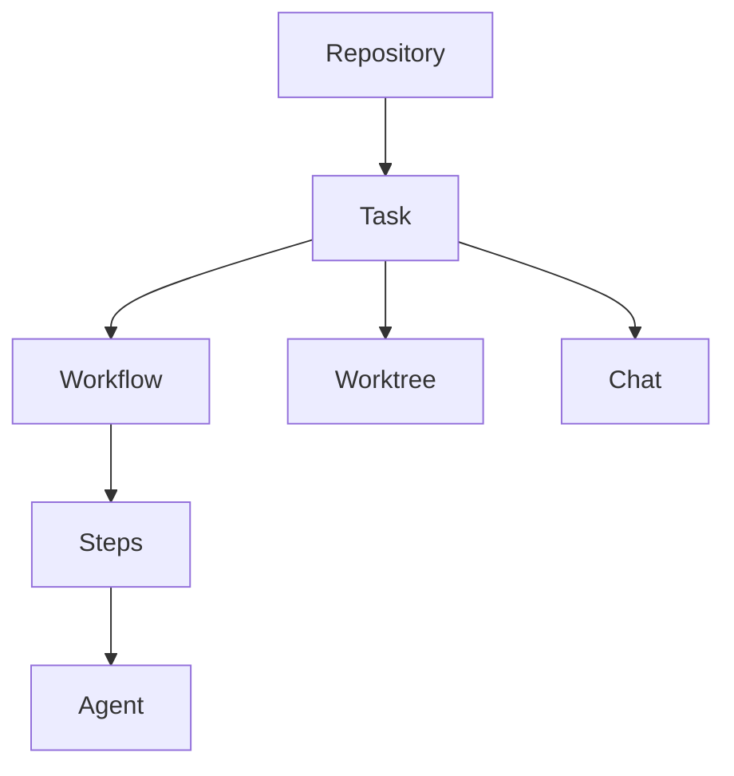

> ## Documentation Index
> Fetch the complete documentation index at: https://docs.zencoder.ai/llms.txt
> Use this file to discover all available pages before exploring further.

# Zenflow Concepts

> The mental model behind Zenflow — repositories, tasks, workflows, worktrees, and agents.

Zenflow organizes AI-driven work into a small set of primitives. Understanding how they fit together makes everything else click.

## Repositories

A repository is a connected codebase. Zenflow clones it, tracks its branches, and uses it as the scope for every Code task.

* **Add from GitHub**, create blank, or select a local folder
* Each repository has its own [automation scripts and configuration](/zenflow/project-configuration)
* Multiple repositories can run tasks simultaneously

<Card title="Deep dive" icon="folder-open" href="/zenflow/projects-overview">
  Repository management, settings, and team configuration
</Card>

## Tasks

A task is the fundamental unit of work. When you create a task, Zenflow spins up an isolated environment and assigns an agent to execute it.

| Property | Description |
| - | - |
| **Mode** | **Code** (git repo + worktree) or **Work** (local folder, no repo) |
| **Workflow** | Determines how the agent approaches the work |
| **Branch** | Dedicated branch created automatically |
| **Worktree** | Isolated directory at `.zenflow/worktrees/{task_id}` |
| **State** | To Do → In Progress → In Review → Done (or Cancelled) |

Tasks support parallel execution — you can run as many as your machine allows, each in its own worktree.

<Card title="Deep dive" icon="list-check" href="/zenflow/tasks-overview">
  Task creation, task view, states, artifacts, and actions
</Card>

## Workflows

Workflows define the execution strategy for a task — how much planning happens, whether specs are generated, and how verification works.

| Workflow | When to use |
| - | - |
| [**Auto**](/zenflow/workflows/auto) | Most tasks — agent decides the approach |
| [**Fix a Bug**](/zenflow/workflows/fix-a-bug) | Regressions and production issues |
| [**Spec First**](/zenflow/workflows/spec-first) | Review the plan before coding starts |
| [**Requirements First**](/zenflow/workflows/requirements-first) | Large features needing PRD → spec → implementation |
| [**Multi-model**](/zenflow/workflows/multi-model) | Different models for planning, building, and review |
| [**Custom**](/zenflow/workflows/custom) | Your own Markdown-defined workflow templates |

Work mode has its own set: **Auto**, **Brainstorm**, **Deep Brainstorm**, **Research**, and **Write**.

<Card title="Deep dive" icon="route" href="/zenflow/task-types">
  Workflow comparison, when to use what, and creating tasks
</Card>

## Git Worktrees

Every Code task runs in its own Git worktree — a separate checkout of the repository with its own branch. This is how Zenflow achieves true parallel execution without conflicts.

* Created automatically at `.zenflow/worktrees/{task_id}`
* Agents read, write, and commit inside the worktree
* Your main working directory is never touched
* Cleaned up when you archive or delete a task

<Card title="Deep dive" icon="code-branch" href="/zenflow/git-worktrees">
  Worktree lifecycle, IDE integration, and best practices
</Card>

## Agents and Presets

An agent is the AI runtime that executes task steps. Zenflow supports multiple agent backends, and you configure them via **presets**.

| Concept | Description |
| - | - |
| **Agent preset** | Named configuration: agent CLI + model + permission mode |
| **Default agent** | The preset used for new tasks (configurable in Settings → Default agents) |
| **Step-level override** | Assign a different preset to individual workflow steps |

Presets are managed in **Settings → Saved presets** and can be selected per-task or per-step.

<Card title="Deep dive" icon="robot" href="/clis/overview">
  Supported agent CLIs and model options
</Card>

## Verification

Zenflow can run verification scripts after each agent turn to catch issues early:

* Configured per-repository in [Repository Configuration](/zenflow/project-configuration)
* Runs linting, type checks, tests, or custom scripts
* Failures are fed back to the agent for self-correction
* Keeps the feedback loop tight so errors don't compound

## Automations

Automations let you schedule recurring tasks — either at the workspace level (cron-style) or inside an existing task (interval-based agent sessions).

<Card title="Deep dive" icon="clock" href="/zenflow/scheduled-automation">
  Creating and managing scheduled automations
</Card>

## Next Steps

<CardGroup cols={2}>
  <Card title="Quickstart" icon="rocket" href="/zenflow/quickstart">
    Create your first task in under 5 minutes
  </Card>

  <Card title="Workflows" icon="list" href="/zenflow/task-types">
    Choose the right workflow for your task
  </Card>

  <Card title="Zenflow Work" icon="desktop" href="/zenflow-work">
    Non-code tasks, automations, and integrations
  </Card>

  <Card title="Repository Configuration" icon="gear" href="/zenflow/project-configuration">
    Verification scripts, setup commands, and presets
  </Card>
</CardGroup>

This documentation is built and hosted on [Mintlify](https://mintlify.com), a developer documentation platform.