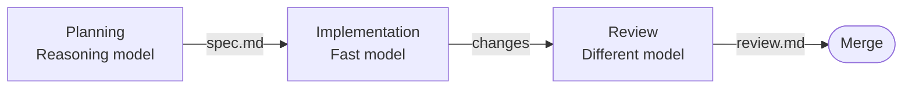

> ## Documentation Index
> Fetch the complete documentation index at: https://docs.zencoder.ai/llms.txt
> Use this file to discover all available pages before exploring further.

# Multi-Agent Orchestration

> Assign different models and agent presets to each workflow step for planning, implementation, and review.

## Overview

Zenflow workflows are built from steps. Each step can run with a different agent, model, and configuration — a planning-focused model for the planning step, a fast model for implementation, and multiple independent reviewers in parallel for code review.

<iframe width="100%" style={{ borderRadius: '12px', marginTop: '16px' }} src="https://www.youtube.com/embed/dUKpKVkHUno" title="Multi-Model Pipelines: 3.5x Cheaper. Better Quality." frameBorder="0" allow="accelerometer; autoplay; clipboard-write; encrypted-media; gyroscope; picture-in-picture" allowFullScreen />

## The Three Phases

Most multi-model workflows break into three phases. Each has a different quality/efficiency tradeoff:

| Phase | What matters | Good fit |
| - | - | - |
| **Planning** | Reasoning depth, architecture decisions, spec quality | Claude Opus, GPT-5.4 |
| **Implementation** | Speed, code generation, tool use | Gemini Flash, Claude Sonnet, Codex |
| **Review** | Catching issues the implementation model missed | A *different* model than the one that wrote the code |

The goal is to use the right model for each phase — frontier reasoning where depth matters, fast models where throughput matters.

### Why Cross-Model Review Matters

A model reviewing its own output is less likely to catch issues — it tends to agree with its own reasoning. A different model brings a different set of assumptions and catches different classes of problems. For higher-stakes changes, running multiple reviewers in parallel gives broader coverage than a single reviewer regardless of which model you pick.

## Two Approaches

<CardGroup cols={2}>
  <Card title="Agent Presets" icon="sliders" href="/zenflow/orchestration/agent-presets">
    Define named model configurations in Settings and bind them to workflow steps. Best for sequential workflows reused across tasks.
  </Card>

  <Card title="Subagent Pipelines" icon="sitemap" href="/zenflow/orchestration/subagent-pipelines">
    Spawn isolated sub-processes with different models, contexts, and skills. Best for parallel execution and context isolation.
  </Card>
</CardGroup>

## Choosing Your Approach

| Situation | Recommended approach |
| - | - |
| Small task, clear scope | Single model, no preset needed |
| Recurring workflow, sequential steps | [Agent Presets](/zenflow/orchestration/agent-presets) with `<!-- agent: preset-name -->` |
| Higher-stakes change needing multi-model review | Sequential review presets |
| Need parallel review or context isolation | [Subagent Pipelines](/zenflow/orchestration/subagent-pipelines) |
| Want multi-model review without a full pipeline | `/comprehensive-review` from chat |

The **Multi-model** workflow is available as a built-in option when creating a task — select it from the workflow picker at the bottom of the task creation screen:

## Runtime Model Switching

You don't have to define everything upfront. During any step, you can switch the active model from the chat composer dropdown. This is useful when:

* A step is stuck and you want to try a different model
* You want a quick second opinion on a specific question
* The default preset for a step isn't performing well on a particular task

The model switch applies to the current chat session. It doesn't change the workflow definition.

## Practical Guidelines

* **Start simple.** A two-preset setup (planner + implementer) already captures most of the value. Add review presets or the full Subagent pipeline when the task warrants it.
* **Don't use the full pipeline for small tasks.** A three-phase Subagent pipeline has real overhead. For a small bug fix, a single model is faster and equally effective.
* **Match model strengths to phase requirements.** Planning needs reasoning depth. Implementation needs speed. Review needs a different perspective.
* **Use the spec as the coordination artifact.** When different models handle different phases, the plan or spec is what keeps them aligned.

## Deep Dives

<CardGroup cols={3}>
  <Card title="Agent Presets" icon="sliders" href="/zenflow/orchestration/agent-presets">
    Named model configs assigned to workflow steps
  </Card>

  <Card title="Subagent Pipelines" icon="sitemap" href="/zenflow/orchestration/subagent-pipelines">
    Parallel execution with isolated contexts
  </Card>

  <Card title="Review Rubric" icon="clipboard-check" href="/zenflow/orchestration/review-rubric">
    Structured evaluation criteria for review steps
  </Card>
</CardGroup>

This documentation is built and hosted on [Mintlify](https://mintlify.com), a developer documentation platform.