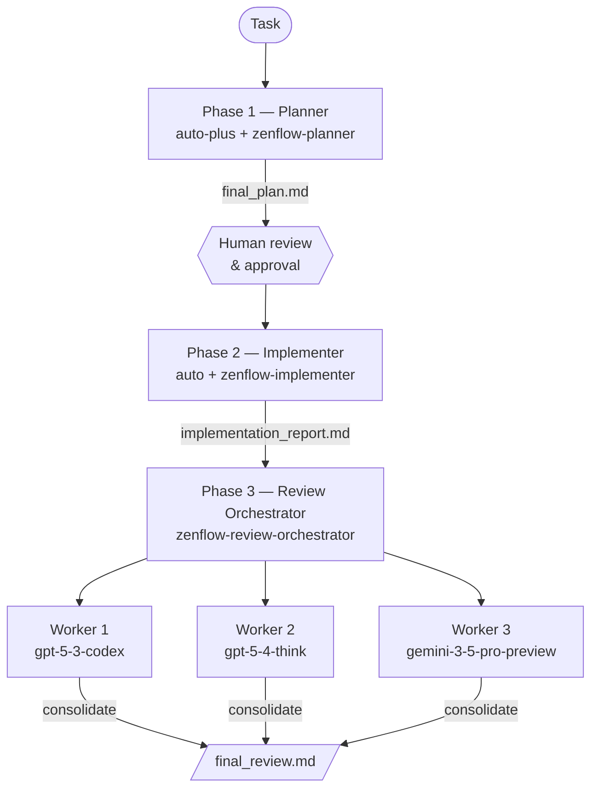

> ## Documentation Index
> Fetch the complete documentation index at: https://docs.zencoder.ai/llms.txt
> Use this file to discover all available pages before exploring further.

# Subagent Pipelines

> Spawn isolated sub-processes with different models, contexts, and skills for parallel execution and clean context isolation.

## Overview

With Subagents, the master agent spawns isolated sub-processes at runtime. Each Subagent has its own fresh context, model, and skill — it doesn't carry the conversation history of the master or previous Subagents. This enables parallel execution (e.g., three reviewers running simultaneously) and keeps the master agent's context clean throughout the pipeline.

<Note>
  **Presets vs. Subagents — which to use:**
  Use **[Agent Presets](/zenflow/orchestration/agent-presets)** when steps run sequentially and you want model assignments configured once in Settings and reused across tasks.
  Use **Subagents** when you need parallel execution within a phase, clean context isolation between phases, or want model assignments to live in the workflow file itself.
</Note>

See the [Subagents](/zenflow/subagents) page for the full reference on how Subagents work.

## The Three-Phase Pipeline

<Tip>
  `auto` and `auto-plus` are Zenflow's managed model selectors. `auto` routes to a fast, cost-efficient model; `auto-plus` routes to a frontier reasoning model. Both are updated automatically as better models become available.
</Tip>

```md theme={"system"}
# Multi-Model Feature Workflow

## Configuration
- **Artifacts Path**: {@artifacts_path} → `.zenflow/worktrees/{task_id}`

---

## Workflow Steps

### [ ] Phase 1: Planner
Spawn a fresh planner Subagent — do not resume, start with a clean context.
Use the `zenflow-planner` skill with `auto-plus` as the model.
Pass the task description as the prompt.
The Subagent must write the final plan to `{@artifacts_path}/final_plan.md` before exiting.

**Human checkpoint — do not proceed to Phase 2 until the user has reviewed and approved `{@artifacts_path}/final_plan.md`.**

### [ ] Phase 2: Implementer
Spawn a fresh implementer Subagent — do not resume, start with a clean context.
Use the `zenflow-implementer` skill with `auto` as the model.
Attach `{@artifacts_path}/final_plan.md` so the Subagent has the approved plan.
The Subagent should implement the plan and write a summary to `{@artifacts_path}/implementation_report.md`.

### [ ] Phase 3: Review Orchestrator
Spawn a fresh review orchestrator Subagent — do not resume, start with a clean context.
Use the `zenflow-review-orchestrator` skill.
Attach `{@artifacts_path}/final_plan.md` and `{@artifacts_path}/implementation_report.md`.

Instruct the orchestrator to spawn three review workers in parallel, one per model:
- Worker 1: `gpt-5-3-codex` → output to `{@artifacts_path}/review_worker_1.json`
- Worker 2: `gpt-5-4-think` → output to `{@artifacts_path}/review_worker_2.json`
- Worker 3: `gemini-3-5-pro-preview` → output to `{@artifacts_path}/review_worker_3.json`

The orchestrator consolidates the three worker outputs into `{@artifacts_path}/final_review.md`.
```



## Why This Structure Works

**Phase 1 — Planner (frontier reasoning model):** Architectural decisions made here flow into every downstream phase. Investing in a high-quality plan pays dividends: the implementer doesn't need to re-derive architecture decisions, and the reviewer has a concrete reference to evaluate against.

**Phase 2 — Implementer (fast model):** Implementation is the most token-intensive phase. A fast model executing a well-defined spec produces equivalent quality to an expensive model working without one — because the spec eliminates the need for architectural exploration. This is where token count is highest and where model selection has the most impact.

**Phase 3 — Review Orchestrator (parallel, diverse models):** The orchestrator spawns three workers simultaneously, each reviewing the diff from a different model's perspective. Cross-model review catches a broader class of issues than same-model review. The orchestrator synthesizes findings into a single consolidated report.

## Built-In Skills

Zenflow ships built-in skills for each phase:

| Skill | Phase | What it does |
| - | - | - |
| `zenflow-planner` | Phase 1 | Produces a structured implementation plan artifact |
| `zenflow-implementer` | Phase 2 | Executes a plan from an artifact file |
| `zenflow-review-orchestrator` | Phase 3 | Spawns parallel review workers and consolidates findings |
| `zenflow-review-worker` | Phase 3 (internal) | Single-model review; called by the orchestrator |

You specify the model; the skill handles the task structure and output format.

You can also trigger the parallel review pattern from chat at any point, without a full pipeline:

```
Run /comprehensive-review on the current changes
```

This uses Subagents to run multiple models against the same diff in parallel and synthesize their findings into a single review.


This documentation is built and hosted on [Mintlify](https://mintlify.com), a developer documentation platform.