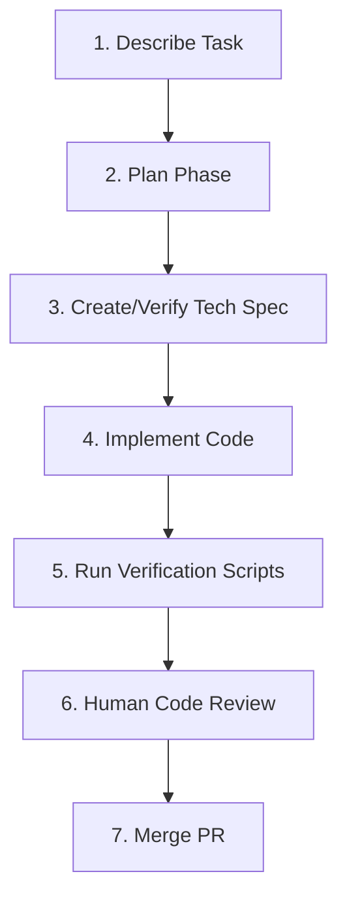

> ## Documentation Index
> Fetch the complete documentation index at: https://docs.zencoder.ai/llms.txt
> Use this file to discover all available pages before exploring further.

# Zenflow Code

> Orchestrate AI coding agents inside your local codebase with Git worktrees, automated verification scripts, and multi-agent pipelines.

## What Zenflow Code Is

**Zenflow Code** is an advanced standalone desktop application built for software engineers who want to supercharge their workflows using AI coding agents. Unlike simple autocomplete extensions, Zenflow Code works directly within your codebase to execute complex multi-file engineering tasks — such as implementing large features, refactoring components, fixing bugs, and writing tests.

  

Zenflow Code provides a highly structured environment that keeps AI co-pilots on track and ensures all changes are thoroughly validated before being merged into your main repository.

***

## Core Capabilities

<CardGroup cols={2}>
  <Card title="Projects & Tasks" icon="folder-tree" href="/zenflow/projects-and-tasks">
    Configure repository settings, default co-pilot presets, and create outcome-based engineering tasks.
  </Card>

  <Card title="Git Worktrees" icon="git-branch" href="/zenflow/git-worktrees">
    Isolate every agent task in a dedicated Git worktree so your active development branch remains completely untouched.
  </Card>

  <Card title="Tracking Changes" icon="list-check" href="/zenflow/tracking-changes">
    Inspect file diffs, view compiler and linter outputs, and manage agent checkpoints with human-in-the-loop reviews.
  </Card>

  <Card title="Multi-Agent Orchestration" icon="arrows-split-up-and-left" href="/zenflow/multi-agent-orchestration">
    Define multi-model pipelines to use specialized models for planning, coding, and review.
  </Card>

  <Card title="Built-in Browser" icon="browser" href="/zenflow/built-in-browser">
    Allow agents to test frontend changes, run end-to-end tests, and capture screenshots in local browser sessions.
  </Card>

  <Card title="VPS Setup" icon="server" href="/zenflow/vps-setup">
    Configure a remote Virtual Private Server to run intensive agent builds and tests off of your local machine.
  </Card>
</CardGroup>

***

## How It Works

Zenflow Code implements **Spec-Driven Development (SDD)** and other specialized execution pipelines to keep agent output highly structured:

1. **Describe Task**: You define a clear, outcomes-oriented prompt outlining what needs to be accomplished.
2. **Plan & Spec**: The agent analyzes your repository structure, creates a technical specification, and requests your approval before writing code.
3. **Isolate & Implement**: Zenflow spawns a background Git worktree to check out a new branch and start the coding phase.
4. **Automated Verification**: After the agent completes its work, Zenflow automatically executes your repository's [verification scripts](/zenflow/projects-and-tasks) (linters, type-checkers, test suites) to find any regression or error.
5. **Review & Merge**: You review the final diff in Zenflow's side-by-side comparison screen and merge the branch directly to GitHub.

***

## Next Steps

To set up Zenflow Code in your workspace, follow the step-by-step installation and onboarding guide:

<Card title="Zenflow Code Quickstart" icon="circle-play" href="/quickstart/zenflow-code">
  Install the desktop application, select default co-pilots, and run your first codebase task in 5 minutes.
</Card>

This documentation is built and hosted on [Mintlify](https://mintlify.com), a developer documentation platform.