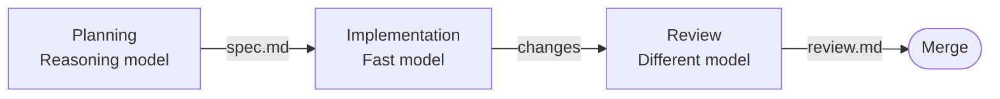

> ## Documentation Index
> Fetch the complete documentation index at: https://docs.zencoder.ai/llms.txt
> Use this file to discover all available pages before exploring further.

# Multi-model

> Assign different AI models to planning, implementation, and review phases for cost-optimized quality.

<Note>
  Multi-model is currently in **beta**. The core functionality is stable but the UI and configuration options may evolve.
</Note>

## Overview

**Multi-model** lets you assign different AI models to each phase of a workflow. Use an expensive reasoning model for planning, a fast model for implementation, and a completely different model for code review. This optimizes both cost and quality — you pay for reasoning only where it matters.

<Tip>
  **Credit Efficiency:** Multi-model is a highly credit-efficient choice for routine tasks, using cheaper models for the bulk implementation phase while reserving premium reasoning models for the planning phase where they are needed most. Learn more in the [Workflow Credit Efficiency](/faq/pricing#workflow-credit-efficiency) reference guide.
</Tip>

## When to Use

* Cost-sensitive teams wanting to optimize credit spend
* Complex tasks where planning quality matters more than implementation speed
* When you want cross-model review (a different model catches different issues)
* Teams that have benchmarked specific models for specific tasks

## The Three Phases

| Phase | What matters | Recommended models |
| - | - | - |
| **Planning** | Reasoning depth, architecture decisions | Claude Opus, GPT-5.4, GPT-5.5 |
| **Implementation** | Speed, code generation, tool use | Gemini Flash, Claude Sonnet, Codex |
| **Review** | Catching issues the builder missed | A *different* model than the one that built the code |

## How It Works

<Steps>
  <Step title="Select Multi-model workflow">
    Choose **Multi-model** when creating a task.
  </Step>

  <Step title="Configure models per phase">
    Assign agent presets to each phase. Create presets in **Settings → Default agents** with specific model and CLI configurations.
  </Step>

  <Step title="Execution">
    The task runs through each phase using the assigned model. Planning generates specs, implementation generates code, and review validates the output.
  </Step>

  <Step title="Review cross-model output">
    The review model provides an independent assessment. Since it has different assumptions than the builder, it catches different classes of issues.
  </Step>
</Steps>

## Agent Presets

Agent presets are named configurations stored in **Settings → Default agents**. Each preset defines:

* **Agent CLI** — which runtime (Zen CLI, Claude Code, Codex, Gemini)
* **Model** — which model the agent uses
* **Configuration** — execution mode, approval policy, tool permissions

Example presets for a multi-model pipeline:

| Preset Name | CLI | Model | Phase |
| - | - | - | - |
| `opus-planner` | Zen CLI | Claude Opus | Planning |
| `flash-builder` | Zen CLI | Gemini Flash | Implementation |
| `sonnet-reviewer` | Zen CLI | Claude Sonnet | Review |

## Why Cross-Model Review

A model reviewing its own output tends to agree with its own reasoning. A different model brings different assumptions and catches different problems. For higher-stakes changes, running multiple reviewers in parallel gives broader coverage than a single reviewer.

## Tips

<AccordionGroup>
  <Accordion title="Start with the default multi-model config">
    Try the default configuration before tuning. It uses a reasoning model for planning and a fast model for implementation — a good baseline.
  </Accordion>

  <Accordion title="Use subagents for parallel review">
    Within the review phase, you can spawn multiple subagents with different models to review the same changes simultaneously. See [Subagents](/zenflow/subagents).
  </Accordion>

  <Accordion title="Match model strengths to phases">
    Opus and GPT-5.4 excel at planning and architecture. Gemini Flash and Sonnet are fast at code generation. Use the cheapest model that meets the quality bar for each phase.
  </Accordion>
</AccordionGroup>

## Related

<CardGroup cols={2}>
  <Card title="All Workflows" icon="list" href="/zenflow/task-types">
    Compare all available workflows
  </Card>

  <Card title="Multi-Agent Orchestration" icon="sitemap" href="/zenflow/multi-agent-orchestration">
    Deep dive into agent presets and subagents
  </Card>

  <Card title="Supported Agents" icon="terminal" href="/clis/overview">
    Available CLI agents and models
  </Card>
</CardGroup>

This documentation is built and hosted on [Mintlify](https://mintlify.com), a developer documentation platform.